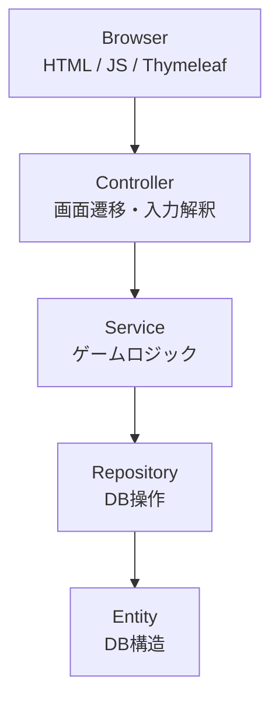
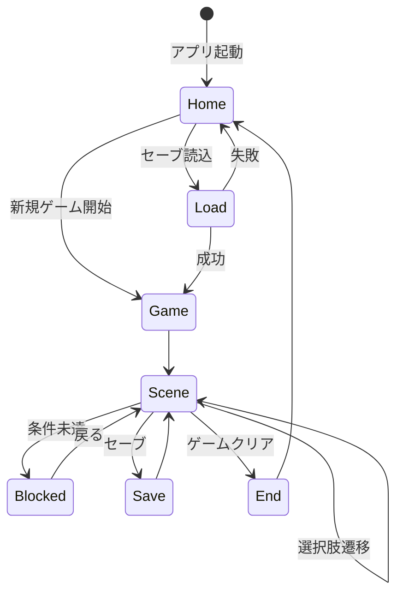

## はじめに
* 本リポジトリはJava学習者のかず(Xアカウント：@kaz_jef_endber)が作った  
Webアプリゲーム「テキストアドベンチャーゲーム」に関するものです。  
* ログイン認証・ゲストプレイ・セーブ / ロード機能を実装し、
Session と DB を利用したゲーム状態管理を行っています。
* ご利用に関するトラブル等の責任は一切負いかねます。 
* ※ 本アプリは「Spring Boot を用いた状態管理・責務分離の理解」を目的として制作しました。

## アプリURL
<u>https://text-adventure-app.onrender.com/<u>
* ゲストログイン機能により、ユーザー登録をせずにプレイ可能です。

> **注意**  
> 初回アクセス時は Spring Boot の起動が走るため、  
> 表示まで数十秒かかる場合があります。

## 目次
* [アプリ概要](#アプリ概要)
* [使用技術](#使用技術)
* [コンセプト](#コンセプト)
* [全体構成図（設計）](#全体構成図設計)
* [レイヤごとの責務](#レイヤごとの責務)
* [ゲーム進行の状態遷移](#ゲーム進行の状態遷移)
* [セーブ / ロード設計](#セーブ--ロード設計)
* [技術選定理由](#技術選定理由)
* [テスト方針 / 単体テスト](#テスト方針--単体テスト)
* [デモ動画](#デモ動画)

* [データベース構成](#データベース構成)
* [ゲームの流れ](#ゲームの流れ)
* [改善・安定化対応](#改善安定化対応)
* [苦労した点](#苦労した点)
* [今後実装してみたい機能](#今後実装してみたい機能)
* [おわりに](#おわりに)

## アプリ概要
*  テキストベースのファンタジー風アドベンチャーゲーム
*  選択肢を選びながらゴールを目指す
*  ログインユーザーは進行状況を保存可能
*  ゲストプレイにも対応

## 使用技術
### Backend
* Java 21
* Spring Boot 3.5
* Spring Security
* Spring MVC
* Thymeleaf

### Database
* MySQL
* H2 Database（Render デプロイ用）

### Frontend
* HTML
* CSS
* JavaScript（Fetch API）

### Infrastructure / Deploy
* Render
* Docker
* GitHub

### Test
* JUnit 5
* Mockito

### Development Environment
* IntelliJ IDEA
* Windows 11

## コンセプト
* webブラウザ上で遊ぶテキストアドベンチャーゲームです。  
* Java学習に際し、Spring Boot(Spring Security)を活用したWebアプリを形にしたいという事で、  
作成してみました。
* 前述の通りSpring Boot(Spring Security)の学習にあたり、単なるCRUDアプリではなく、ユーザー体験を
意識したインタラクティブなコンテンツとしてテキストアドベンチャーゲームを選択しました。
* シンプルな構成ながら、以下の実装課題に取り組みました
    - ログイン認証とゲストモードの切り替え
    - シーン選択による状態遷移
    - アイテム・イベントフラグによる分岐制御
    - セーブ / ロードによる状態の永続化

## 全体構成図（設計）

## レイヤごとの責務
* Controller 
    - HTTP リクエストの受付
    - 画面遷移の制御
    - ゲスト / ログイン状態の切り替え
    - View へのデータ受け渡し

* Service 
    - シーン遷移判定
    - アイテム・フラグ管理
    - ブロック判定
    - セーブ / ロード制御

* Repository / Entity 
    - DB 永続化
    - Entity は DB 構造のみを表現
    - Repository は CRUD 操作に限定

* View / JavaScript 
    - 表示制御
    - 画面非同期通信（Fetch API）
    - CSRF 対応
    - UX 向上（ローディング・トースト）

## ゲーム進行の状態遷移

## セーブ / ロード設計
* 保存内容
    - currentSceneId：現在表示中のシーン
    - items：所持アイテム一覧
    - flags：イベント進行フラグ

* 設計方針
    - ゲーム状態をスナップショットとして保存
    - セッションと DB を分離
    - ゲストプレイ時は DB 保存しない

### 状態管理方針

本アプリでは、

- Session：プレイ中の一時状態
- save_data：ゲーム進行状態の永続化

として責務を分離しています。

#### Session

- playerItems
- pendingReward
- guestMode
- foodEventUsed

#### save_data

- currentSceneId
- items
- flags

ロード時には save_data の内容を Session に復元し、
ゲーム状態を再構築します。

## 技術選定理由
* Spring Boot：MVC 構造と責務分離を学ぶため
* Spring Security：認証・ゲスト切替の理解
* Thymeleaf：サーバーサイドレンダリング学習
* MySQL：永続化の基本構造理解    

## テスト方針 / 単体テスト
本アプリでは、ゲームロジックの安定性を重視し、  
Service 層を中心に単体テストを実施しました。

* テスト対象
    - シーン遷移判定ロジック
    - フラグ判定
    - セーブ / ロード処理の正常系

* 設計方針
    - Controller は I/O が多いためテスト対象外
    - Repository の細かい振る舞い検証は対象外
    - サービス層のロジックが最低限正しく動くことを確認

* 使用技術
    - JUnit 5
    - Mockito（一部依存のスタブ化）

## デモ動画
* ユーザー登録→ゲーム開始
* https://github.com/user-attachments/assets/45dab199-a35a-44cf-9aa6-4c5391bba542
 

* ゲストプレイ→ゲーム開始
* https://github.com/user-attachments/assets/7d6bf956-5ce2-4dd2-a47a-da423531150c

## データベース構成
### player_data

| カラム | 内容 |
|---|---|
| username | ログインID |
| password | BCrypt化パスワード |
| nickname | 表示用プレイヤー名 |
| favorite | 好物イベント用 |

* データベース内構造(プレーヤー情報)

* 実際の表示例(プレーヤー情報)

### save_data

| カラム | 内容 |
|---|---|
| current_scene_id | 現在シーン |
| previous_scene_id | 直前シーン |
| items | 所持アイテム(JSON) |
| flags | イベントフラグ(JSON) |

* データベース内構造(セーブデータ)

* 実際の表示例(セーブデータ)

## ゲームの流れ
1. ログインまたはゲストとして開始
2. 表示される選択肢を選びながら進行
3. 状況に応じてイベントが分岐
4. エンディング(GameOver表示)に到達すると終了

## 改善・安定化対応
本アプリは初期実装後、
状態管理・責務分離・例外処理の観点から
段階的にリファクタリングを行いました。

### 実施した改善
* JSON変換処理の共通化
    - ObjectMapper の乱立を廃止
    - JsonUtils に統一
* セッションとDB状態の不整合修正
    - pendingReward を導入
    - 「ロードせず所持している」問題を修正

* イベントフラグ管理の整理
    - save_data.flags を状態管理の主軸へ統一
    - session → DB → load復元 の流れへ整理

* 例外処理の改善
    - GlobalExceptionHandler を追加
    - GameException による業務例外整理

* ログ出力整理
    - INFO / WARN / ERROR を使い分け
    - シーン遷移・セーブ処理を記録

* 定数管理の整理
    - SessionKeys を導入し Session 属性名を集約
    - SceneIds を導入しシーンIDのマジックストリングを排除

## 苦労した点
### セッション状態とDB状態の整合性
ゲーム進行中の状態を
Session と DB の両方で管理しているため、

* セーブ直前の状態
* ロード後の状態
* ゲストプレイ状態

の整合性維持に苦労しました。

特に、
「画面上では取得済みだが、
ロードしていないためDB未保存」
という状態不整合が発生したため、

pendingReward を導入し、
取得確定タイミングを整理しました。

### 責務分離

初期実装では Controller に
状態更新ロジックが混在していました。

そのため、

* SceneService
* SaveDataService
* FavoriteService
* JsonUtils

へ責務を分離し、
保守性改善を行いました。

## 今後実装してみたい機能
* シーン情報の DB 管理化
    - 現在はコード内で管理
    - 将来的には動的追加可能な構成へ改善予定

* テスト拡充
    - Controller 層テスト
    - 異常系テスト
    - MockMvc 導入

* ログ改善
    - ファイル出力
    - リクエスト単位の追跡
    - 本番運用を想定したログ設計

## おわりに
* Java学習のアウトプットとして、本リポジトリを公開しました
* 設計・責務分離・状態管理を意識しました
* 感想・コメント等あればXアカウントまでご連絡くださると幸いです

