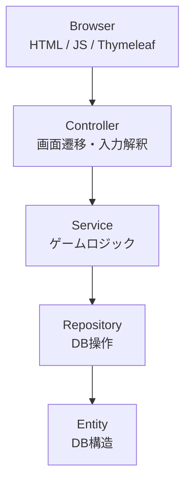
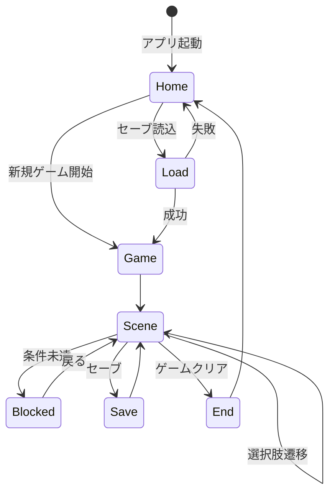

## はじめに
* 本リポジトリはJava学習者のかず(Xアカウント：@kaz_jef_endber)が作った  
Webアプリゲーム「テキストアドベンチャーゲーム」に関するものです。  
* ご利用に関するトラブル等の責任は一切負いかねます。 
* ※ 本アプリは「Spring Boot を用いた状態管理・責務分離の理解」を目的として制作しました。

## アプリURL
<u>https://text-adventure-app.onrender.com/<u>
* ゲストログイン機能により、ユーザー登録をせずにプレイ可能です。

> **注意**  
> 初回アクセス時は Spring Boot の起動が走るため、  
> 表示まで数十秒かかる場合があります。

## 目次
* [コンセプト](#コンセプト)
* [アプリ概要](#アプリ概要)
* [全体構成図（設計）](#全体構成図設計)
* [レイヤごとの責務](#レイヤごとの責務)
* [ゲーム進行の状態遷移](#ゲーム進行の状態遷移)
* [セーブ / ロード設計](#セーブ--ロード設計)
* [技術選定理由](#技術選定理由)
* [デモ動画](#デモ動画)
* [環境](#環境)
* [データベース構成](#データベース構成)
* [ゲームの流れ](#ゲームの流れ)
* [苦労した点](#苦労した点)
* [今後実装してみたい機能](#今後実装してみたい機能)
* [おわりに](#おわりに)

## コンセプト
* webブラウザ上で遊ぶテキストアドベンチャーゲームです。  
* Java学習に際し、Spring Boot(Spring Security)を活用したWebアプリを形にしたいという事で、  
作成してみました。
* 前述の通りSpring Boot(Spring Security)の学習にあたり、単なるCRUDアプリではなく、ユーザー体験を
意識したインタラクティブなコンテンツとしてテキストアドベンチャーゲームを選択しました。
* シンプルな構成ながら、以下の実装課題に取り組みました
    - ログイン認証とゲストモードの切り替え
    - シーン選択による状態遷移
    - アイテム・イベントフラグによる分岐制御
    - セーブ / ロードによる状態の永続化

## アプリ概要
*  テキストベースのファンタジー風アドベンチャーゲーム
*  選択肢を選びながらゴールを目指す
*  ログインユーザーは進行状況を保存可能
*  ゲストプレイにも対応

## 全体構成図（設計）

## レイヤごとの責務
* Controller 
    - HTTP リクエストの受付
    - 画面遷移の制御
    - ゲスト / ログイン状態の切り替え
    - View へのデータ受け渡し

* Service 
    - シーン遷移判定
    - アイテム・フラグ管理
    - ブロック判定
    - セーブ / ロード制御

* Repository / Entity 
    - DB 永続化
    - Entity は DB 構造のみを表現
    - Repository は CRUD 操作に限定

* View / JavaScript 
    - 表示制御
    - 画面非同期通信（Fetch API）
    - CSRF 対応
    - UX 向上（ローディング・トースト）

## ゲーム進行の状態遷移

## セーブ / ロード設計
* 保存内容
    - currentSceneId：現在表示中のシーン
    - items：所持アイテム一覧
    - flags：イベント進行フラグ

* 設計方針
    - ゲーム状態をスナップショットとして保存
    - セッションと DB を分離
    - ゲストプレイ時は DB 保存しない

## 技術選定理由
* Spring Boot：MVC 構造と責務分離を学ぶため
* Spring Security：認証・ゲスト切替の理解
* Thymeleaf：サーバーサイドレンダリング学習
* MySQL：永続化の基本構造理解    

## デモ動画
* ユーザー登録→ゲーム開始
* https://github.com/user-attachments/assets/2e1c12ba-0cd3-4898-800b-3f590391f894

* ゲストプレイ→ゲーム開始
* https://github.com/user-attachments/assets/94a301f2-33d7-4d08-98d0-5c632b2ef258
* ※とても短いゲームですが、デモはゲーム途中までを流しています。

## 環境
| ツール、環境  | バージョン  |
| ------------- | ------------- |
| 設計言語  | Oracle JDK Java21  |
| 作業環境  | Windows 11(24H2)  |
| MySql  |  8.0.42  |
| Spring Boot  | 3.5.6  |
| デプロイ環境  | Render  |

## データベース構成
* データベース内構造
* 
* 実際の表示例

## ゲームの流れ
1. ログインまたはゲストとして開始
2. 表示される選択肢を選びながら進行
3. 状況に応じてイベントが分岐
4. エンディング(GameOver表示)に到達すると終了

## 苦労した点
* アイテム所持状態によるルート分岐の実装
* セッション破棄・再ログイン時の挙動を整理する必要があり、設計を見直しました

## 今後実装してみたい機能
* 分岐エンディング
* 選択肢の DB 管理

## おわりに
* Java学習のアウトプットとして、本リポジトリを公開しました
* 設計・責務分離・状態管理を意識しました
* 感想・コメント等あればXアカウントまでご連絡くださると幸いです

